# linuxify-color

**Your Mac's terminal, but it feels like Ubuntu.**

macOS ships a BSD userland whose flags don't match the scripts you copy off
Stack Overflow, and a shell that renders every last thing in the same shade of
white. `linuxify-color` fixes both — the real GNU tools, plus the colored,
legible terminal you've missed since you last used Linux.


## What you get

### The GNU userland

`ls`, `grep`, `sed`, `find`, `awk`, `tar`, `make` and 40+ more packages,
replaced with the versions the rest of the world documents. No more `gsed`. No
more `sed -i ''`. No more man pages missing the flag you need.

<table>
<tr><th width="50%">Stock macOS</th><th width="50%">With linuxify-color</th></tr>
<tr>
<td>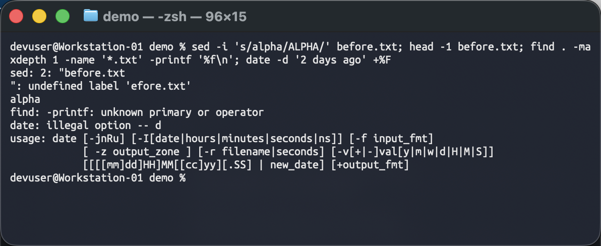</td>
<td>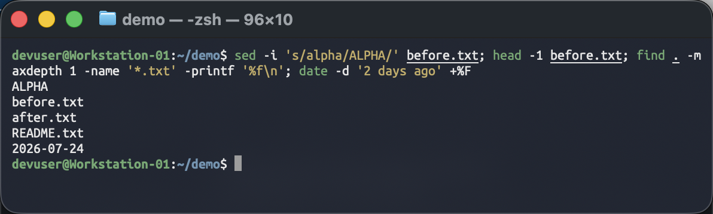</td>
</tr>
</table>

Same three commands. On the left, `sed -i` needs an argument it didn't get,
`find` has never heard of `-printf`, and `date` has no `-d` — note that
`head -1` still prints `alpha`, because the in-place edit silently didn't
happen. On the right they just work.

### Color, everywhere it should be

`ls` driven by `dircolors`, so directories, symlinks, archives and executables
are distinguishable at a glance — and a broken symlink announces itself.

<table>
<tr><th width="50%">Stock macOS</th><th width="50%">With linuxify-color</th></tr>
<tr>
<td>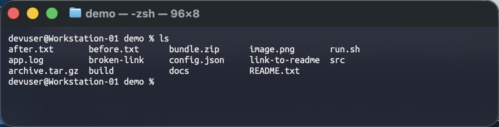</td>
<td>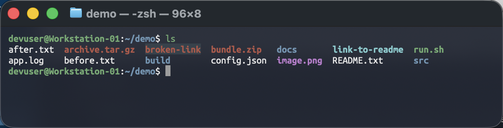</td>
</tr>
</table>

Man pages get colored headings and keywords. You also get the GNU page rather
than the BSD one, which is usually the page you were actually looking for.

<table>
<tr><th width="50%">Stock macOS</th><th width="50%">With linuxify-color</th></tr>
<tr>
<td>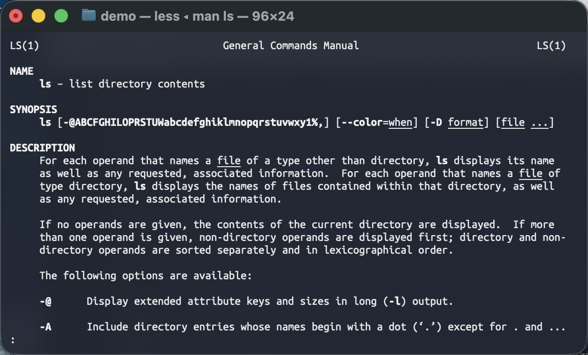</td>
<td>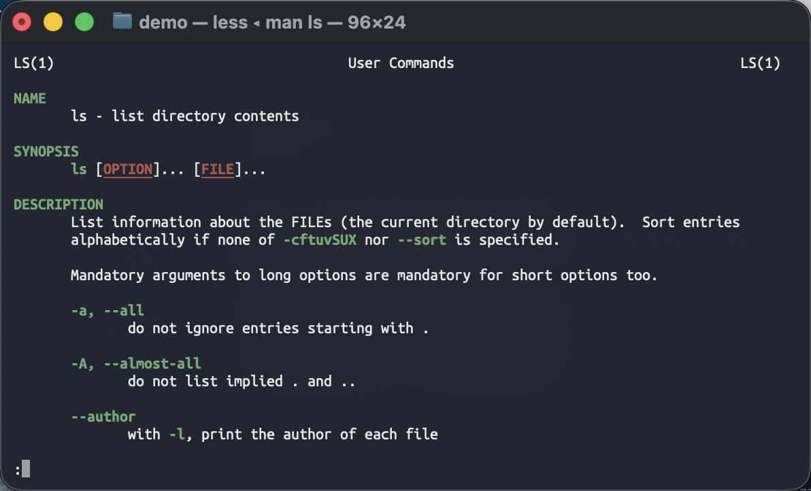</td>
</tr>
</table>

Also colored: `grep` matches — right through the
`zgrep`/`bzgrep`/`xzgrep`/`zstdgrep` compressed variants — `diff` in red and
green, and an Ubuntu-style green-and-blue `user@host:~/path$` prompt.

### A `less` that reads compressed files

`lesspipe` means archives open as archives instead of as a dare.

<table>
<tr><th width="50%">Stock macOS</th><th width="50%">With linuxify-color</th></tr>
<tr>
<td>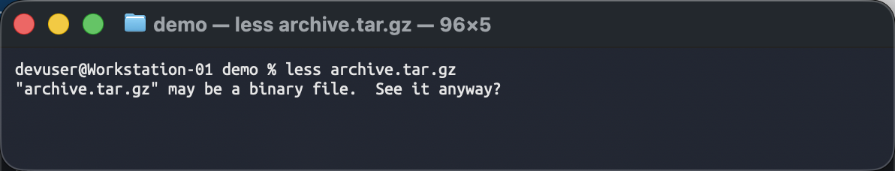</td>
<td>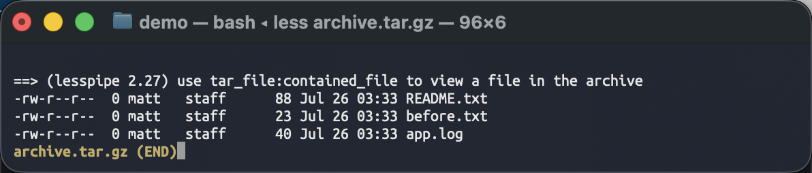</td>
</tr>
</table>

### The tools every distro ships and macOS doesn't

`htop`, `tree`, `watch`, `mtr`, and `ip`.

<table>
<tr><th width="50%">Stock macOS</th><th width="50%">With linuxify-color</th></tr>
<tr>
<td>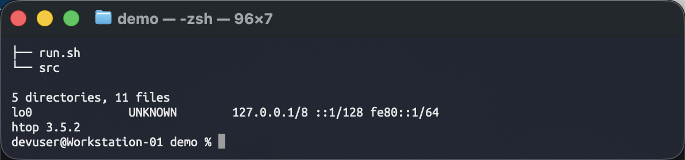</td>
<td>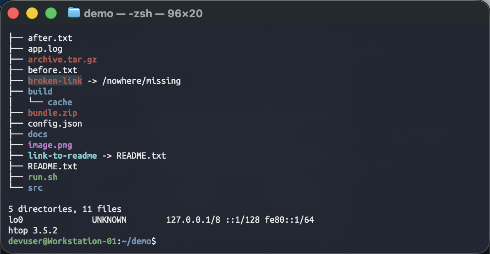</td>
</tr>
</table>

Two caveats on the networking pair: `mtr` needs `sudo` to open raw sockets, and
`ip` comes from `iproute2mac`, which is a reimplementation rather than a port —
it covers the subcommands you reach for daily and not much beyond them. You
also get a newer `jq` than the 1.7.1 Apple now ships.

### A shell that helps

`zsh-autosuggestions` finishes your sentences from history, and
`zsh-syntax-highlighting` tells you a command doesn't exist before you hit
enter. Plus a `fastfetch` banner on login.

<table>
<tr><th width="50%">Suggestion from history, in grey</th><th width="50%">A typo, caught before enter</th></tr>
<tr>
<td>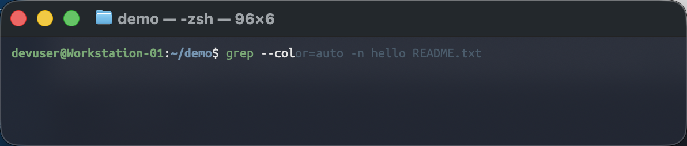</td>
<td>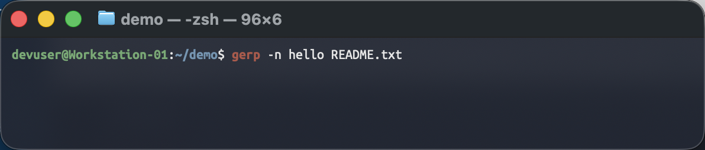</td>
</tr>
</table>

Tested through macOS Big Sur (11), Monterey (12), Ventura (13), Sonoma (14),
Sequoia (15), and Tahoe (26).

## Install

```bash
git clone https://github.com/mattanderson-io/linuxify-color.git
cd linuxify-color/
./linuxify install
```

Open a new terminal. That's the whole thing.

## How it works

Everything lives in one directory, `~/.config/linuxify/` (or under
`$XDG_CONFIG_HOME` if you've moved it):

- **`environment.sh`** updates your PATH, MANPATH, and friends so the GNU tools
  come first without a `g` prefix, and switches on `--color=auto` and
  `lesspipe`. Shell-agnostic.
- **`zsh-integration.zsh`** sets up the prompt, colored man pages, the fastfetch
  banner, and the zsh plugins, and sources `environment.sh` for you. zsh only.

So your `~/.zshrc` gains exactly one line:

```bash
source "${XDG_CONFIG_HOME:-$HOME/.config}/linuxify/zsh-integration.zsh"
```

Bash users add the other file to `~/.bashrc` by hand:

```bash
source "${XDG_CONFIG_HOME:-$HOME/.config}/linuxify/environment.sh"
```

Your existing `~/.zshrc` is never overwritten. The line is appended only if
it's missing, and your original is kept at `~/.zshrc.linuxify.bak`.

Nothing here exports `LDFLAGS`, `CPPFLAGS` or `PKG_CONFIG_PATH`. Setting those
globally would quietly make every unrelated build on your machine link against
Homebrew's keg-only libraries, which is a miserable thing to debug. Set them
per project instead.

Your login shell is left alone.

The screenshot uses the Ubuntu font, which the script doesn't install. To match
it exactly:

```bash
brew install --cask font-ubuntu font-ubuntu-mono
```

then choose Ubuntu Mono under Terminal → Settings → Profiles → Text.

## Uninstall

```bash
./linuxify uninstall
```

Removes `~/.config/linuxify/` and strips the line it added to your `~/.zshrc`.
If you'd put anything else in that directory, the directory stays.

**It only removes packages it installed.** The install records every formula it
actually had to install in
`${XDG_STATE_HOME:-~/.local/state}/linuxify/installed-formulas`, and uninstall
works from that list. A `git`, `vim` or `python` you already had is left
exactly where it was. Anything another package still depends on is kept too,
and reported rather than silently skipped.

You can watch it decide — re-running the install on a machine that already has
these packages touches nothing:

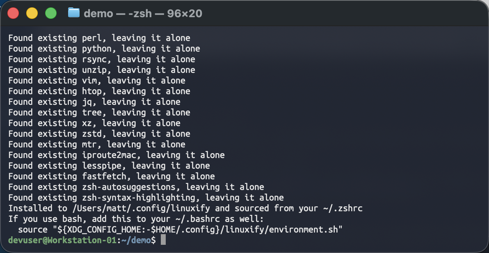

## Development

```bash
brew install shellcheck bats-core
shellcheck linuxify tests/fake-brew && shellcheck --shell=sh environment.sh
bats tests/
```

`tests/fake-brew` stands in for Homebrew, so the suite exercises real install
and uninstall runs without touching the machine it's running on.

The screenshots are reproducible. `screenshots/tools/demo-scene.sh` builds the
fixed `~/demo` directory every shot uses, and
`screenshots/tools/shot.sh <out.png> <rows> <command>` drives Terminal and
captures the window. `reshoot.sh` runs the whole before/after pass, temporarily
overriding `PROMPT` and pointing `fastfetch` at
`screenshots/tools/fastfetch.jsonc` so no hostname or IP ends up in a public
image, and restoring both afterwards.

## Credits

A fork of [pkill37/linuxify](https://github.com/pkill37/linuxify), which does
the heavy lifting of installing and PATH-ordering the GNU userland. This fork
adds the color configuration, the prompt, the compressed-file handling, and the
shell plugins — and makes the installer set them up for you rather than leaving
you a file to wire in yourself.
